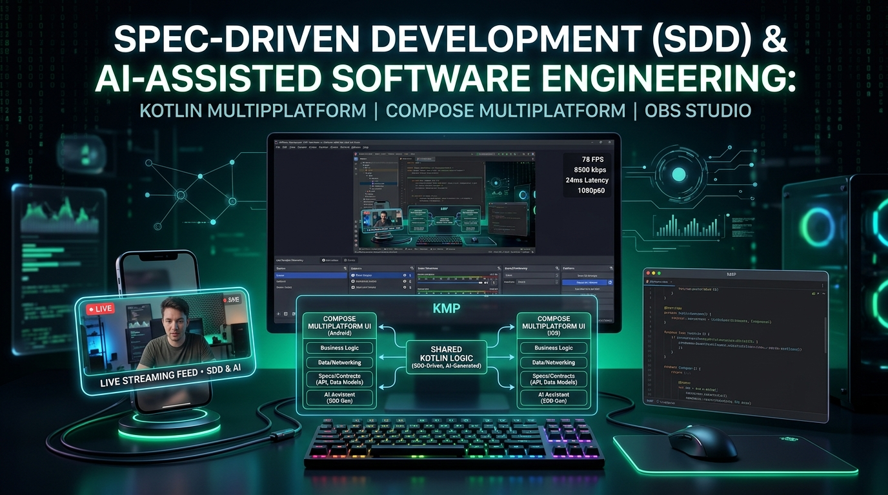
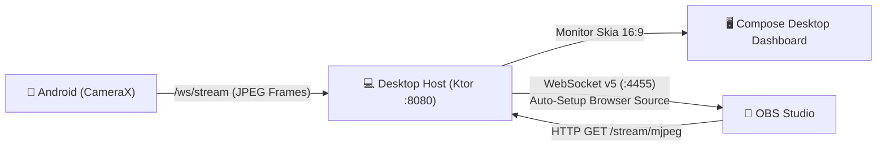
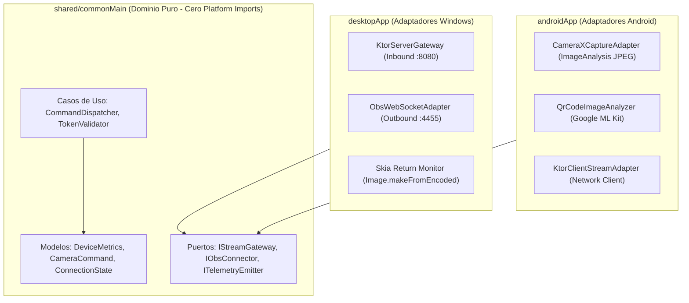

# Virtual Studio Companion

<div align="center">



**Transforma tu dispositivo móvil Android en una cámara de transmisión de ultra-baja latencia para OBS Studio en Windows.**

[](https://kotlinlang.org/docs/multiplatform.html)
[](https://www.jetbrains.com/lp/compose-multiplatform/)
[](https://blog.cleancoder.com/uncle-bob/2012/08/13/the-clean-architecture.html)
[](https://obsproject.com/)
[](LICENSE)
[](https://github.com/dhbernardo/virtual-studio-companion/releases/tag/v1.0.1)
[](https://github.com/dhbernardo/virtual-studio-companion)

</div>

---

## 1. ¿Qué es Virtual Studio Companion?

**Virtual Studio Companion** es una suite multiplataforma de grado profesional desarrollada con **Kotlin Multiplatform (KMP)** y **Compose Multiplatform**. Permite convertir cualquier smartphone Android moderno en una fuente de cámara de estudio inalámbrica para **OBS Studio** en Windows, operando con telemetría en vivo, sincronización bidireccional de controles y **cero dependencias de Java instaladas en el equipo del usuario final**.

El sistema se compone de dos aplicaciones coordinadas en un monorepo modular:
1. **Android App (`androidApp`):** Captura video a 1080p con **CameraX**, comprime cuadros a JPEG en hilos de hardware dedicados (`CameraX-Worker`), calcula FPS y bitrate reales, escanea códigos QR con **Google ML Kit** y transmite telemetría periódica.
2. **Windows Desktop Host (`desktopApp`):** Servidor local embebido con **Ktor** (fallback dinámico en puertos `8080-8090`), generador de QR estandarizado **ISO/IEC 18004** con **ZXing Core**, **Monitor de Retorno de Video Nativo** acelerado por hardware mediante **Skia** en Compose Desktop, y conector nativo con **OBS Studio** mediante **OBS WebSocket API v5**.

---

## 2. Características Principales

- **Emparejamiento Óptico Instantáneo:** Código QR dinámico con estándar internacional ISO/IEC 18004, temporizador de cuenta regresiva TTL (120 s), token efímero y diálogo de contingencia manual (IP/Token).
- **Monitor de Retorno Nativo en Windows:** Decodificación directa por hardware con Skia (`org.jetbrains.skia.Image.makeFromEncoded`) en relación 16:9 sin navegadores incrustados pesados (cero Chromium, CEF o WebViews externos).
- **Streaming MJPEG Continuo para OBS:** Endpoints HTTP `/stream/mjpeg` (`multipart/x-mixed-replace; boundary=frame`) y vista previa responsive en `/stream/preview`.
- **Integración Nativa con OBS WebSocket API v5:** Handshake autenticado SHA256, inyección e idempotencia automática de la fuente *Browser Source* (`Virtual Studio Camera`).
- **Conexión y Desconexión Independiente de OBS:** Control contextual desacoplado en UI ("Conectar OBS" / "Desconectar OBS") que no interrumpe el streaming del móvil ni el monitor de video.
- **Sincronización Simétrica Bidireccional:** Control de Zoom (1.0x – 10.0x) y Linterna (Torch) ejecutable tanto desde el móvil como desde el PC, sin bucles de rebote (*echo loops*).
- **Telemetría en Tiempo Real:** Medición de latencia RTT mediante Ping/Pong periódico (1000 ms), tasa de fotogramas (FPS) reales, Bitrate en tiempo real (Kbps), nivel de batería y reducción automática a 30 FPS ante sobrecalentamiento (*Thermal Alert*).
- **Cero Dependencias de Java en el Cliente:** La aplicación de escritorio se empaqueta con `jpackage` y un micro-runtime Temurin (`jlink`), generando un instalador nativo `.exe` o `.msi` autocontenido.
- **Design System Compartido:** Temas *Studio Dark* y *Studio Light* con detección reactiva del sistema operativo (`isSystemInDarkTheme()`) y 100% de textos centralizados (`Res.string.*`).

---

## 3. Guía de Configuración y Pruebas con OBS Studio

Virtual Studio Companion se integra con OBS Studio mediante dos modalidades: **Automática** (vía WebSocket v5) o **Manual** (agregando la fuente de navegador).



---

### Método A: Integración Automática vía OBS WebSocket v5 (Recomendado)

Este método permite que el Host configure automáticamente la fuente en OBS Studio sin que tengas que copiar URLs manualmente.

1. **Abrir OBS Studio** (versión 28.0 o superior, la cual incluye WebSocket v5 de forma nativa).
2. En el menú superior de OBS, ingresar a:  
   **Herramientas (Tools) ➔ Ajustes del servidor WebSocket (WebSocket Server Settings)**.
3. Marcar la casilla:  
   ✅ **Habilitar el servidor WebSocket (Enable WebSocket server)**.
4. **Parámetros del servidor:**
   - **Puerto del servidor (Server Port):** Asegurarse de que esté en `4455` (puerto por defecto).
   - **Autenticación (Authentication):** Si está activada, puedes definir una contraseña o desmarcarla para desarrollo local sin clave.
   - Hacer clic en **Aplicar (Apply)** y **Aceptar (OK)**.
5. **Vincular desde Virtual Studio Companion:**
   - Inicia el Host en Windows (`./gradlew :desktopApp:run`).
   - En la interfaz del Host, haz clic en el botón **"Conectar OBS"** (ubicado en la barra superior tanto en la pantalla de emparejamiento QR como en el Dashboard de transmisión).
   - El Host se conectará a `ws://localhost:4455`, resolverá el desafío de autenticación SHA256 y creará automáticamente una fuente de navegador (*Browser Source*) denominada **`Virtual Studio Camera`** en la escena activa de OBS.
   - Si la fuente ya existía, actualizará sus dimensiones (1080p, 60 FPS) y la URL local de forma idempotente.
6. **Desconexión Independiente:**
   - Si deseas desvincular el control de OBS sin desconectar la cámara de tu teléfono móvil, pulsa **"Desconectar OBS"**.

---

### Método B: Configuración Manual de Browser Source (Contingencia sin WebSocket)

Si prefieres no usar el servidor WebSocket de OBS, puedes agregar el stream como una fuente de navegador web estándar:

1. Inicia el Host de Windows y empareja tu teléfono móvil. Observa la dirección IP que aparece en pantalla (ej. `192.168.1.121:8080`).
2. En OBS Studio, ve al panel **Fuentes (Sources)** y haz clic en el botón **`+`**.
3. Selecciona **Navegador (Browser)** y nómbrala `Virtual Studio Camera`.
4. En la ventana de propiedades de la fuente, configura los siguientes valores:
   - **URL:** `http://localhost:8080/stream/preview` (o `http://<IP_HOST>:8080/stream/preview`).
   - **Ancho (Width):** `1920`
   - **Alto (Height):** `1080`
   - **Frecuencia de imágenes personalizada (FPS):** `60`
   - **CSS personalizado:** Dejar el valor por defecto:
     ```css
     body { background-color: rgba(0, 0, 0, 0); margin: 0px auto; overflow: hidden; }
     ```
   - ✅ Marcar: **Actualizar el navegador cuando la escena se active (Refresh browser when scene becomes active)**.
5. Haz clic en **Aceptar (OK)**. El video capturado por la cámara de tu teléfono se mostrará de inmediato en el lienzo de OBS Studio.

---

## 4. Arquitectura y Topología del Monorepo

El proyecto sigue estrictamente **Clean Architecture** y el patrón de **Puertos y Adaptadores (Arquitectura Hexagonal)**:

```
virtual-studio-companion/
├── shared/                     # Módulo KMP Compartido
│   └── src/commonMain/kotlin/
│       ├── core/domain/model/  # Entidades puras: CameraCommand, ConnectionState, DeviceMetrics
│       ├── core/domain/usecase/# Casos de uso: ValidateToken, DispatchCommand, SessionTimer
│       ├── core/ports/         # Contratos: IStreamGateway, IObsConnector, ITelemetryEmitter
│       ├── core/protocol/      # Serialización binaria/JSON: ProtocolMessage (Handshake, Ping, Pong)
│       └── designsystem/       # Tokens compartidos: StudioTheme, StudioColors, StudioShapes
├── desktopApp/                 # Windows Host (JVM Desktop)
│   └── src/desktopMain/kotlin/
│       ├── adapters/inbound/   # KtorServerGateway (Ktor CIO, Ping RTT, MJPEG stream)
│       ├── adapters/outbound/  # ObsWebSocketAdapter (Ktor WS Client, OBS v5, SHA256)
│       └── presentation/       # MainWindow, StreamingDashboardView, Skia Return Monitor
├── androidApp/                 # Cliente Móvil Android
│   └── src/main/kotlin/
│       ├── adapters/camera/    # CameraXCaptureAdapter (Hardware YUV->JPEG, rotation matrix)
│       ├── adapters/network/   # KtorClientStreamAdapter (WebSocket client, cleartext traffic)
│       ├── adapters/qr/        # QrCodeImageAnalyzer (Google ML Kit Barcode Scanning)
│       └── presentation/       # CameraScreen, QrScannerScreen, CameraStreamViewModel
├── specs/                      # Especificaciones SDD Vivas (spec.md, plan.md, tasks.md)
└── docs/                       # Constitución y Documentación Técnica
    ├── constitution.md         # 8 Leyes Innegociables del Proyecto
    └── articles/               # Artículos de Arquitectura e Ingeniería
```

### Puertos y Adaptadores en `shared/commonMain`



---

## 5. Constitución del Proyecto (`docs/constitution.md`)

Cualquier cambio o evolución del código está regido por principios de calidad no negociables:

1. **Núcleo Compartido Puro:** Prohibido importar `android.*`, `java.*` o APIs de plataforma en `shared/commonMain`.
2. **Cero Dependencia de Java en el Cliente:** El instalador final de Windows encapsula su propio micro-runtime Temurin mediante `jpackage`. El usuario final jamás necesita instalar JDK o JRE.
3. **Licenciamiento Estricto y Permisivo:** Solo librerías bajo licencias abiertas permisivas (Apache 2.0, MIT, BSD). Prohibido el copyleft restrictivo (GPLv3).
4. **Resiliencia de Red:** La sincronización no asume que mDNS esté disponible (por aislamiento de routers Wi-Fi). El escaneo QR es el mecanismo primario incondicional.
5. **Cero Hardcoded Strings:** Todo texto visible en Compose Desktop y Android se consume mediante **Compose Multiplatform Resources** (`Res.string.*`).

---

## 6. Comandos de Desarrollo y Compilación

### Requisitos Previos
- **JDK:** OpenJDK 17 o 21 (Adoptium Temurin recomendado).
- **Android SDK:** Build Tools 34.0.0 y Android SDK API 34 instalados.
- **Sistema Operativo:** Windows 10/11 (para ejecutar el Host nativo de escritorio) o Linux/macOS (para compilación compartida y de Android).

### Comandos Frecuentes

```powershell
# 1. Ejecutar toda la suite de pruebas unitarias automatizadas (80 tareas)
./gradlew allTests

# 2. Ejecutar validaciones y tests del módulo compartido
./gradlew :shared:check

# 3. Iniciar la aplicación de escritorio en modo desarrollo
./gradlew :desktopApp:run

# 4. Compilar el APK de desarrollo para Android
./gradlew :androidApp:assembleDebug

# 5. Instalar APK directamente en un dispositivo Android conectado por ADB
adb install -r androidApp/build/outputs/apk/debug/androidApp-debug.apk

# 6. Generar instalador nativo autocontenido de Windows (.msi o .exe) mediante jpackage
./gradlew :desktopApp:packageMsi
# El binario autocontenido se generará en: desktopApp/build/compose/binaries/main/msi/
```

---

## 7. Spec-Driven Development (SDD) y Desarrollo con IA

Este proyecto fue construido íntegramente utilizando la metodología **Spec-Driven Development (SDD)**, demostrando cómo gobernar a los modelos de lenguaje y agentes de IA para evitar el *"Vibe Coding"* y erradicar la deuda técnica por parches desordenados.

Para conocer en profundidad la metodología, el marco de gobernanza y el **Kit de Prompts Operativos** (incluyendo el prompt de diagnóstico sin parches prematuros y el prompt canónico de refinamiento), consulta el artículo completo:

👉 **[Leer Artículo en Dev.to: Spec-Driven Development (SDD) con IA](https://dev.to/davidbernardo/spec-driven-development-sdd-con-ia-dejando-atras-el-vibe-coding-para-construir-software-nd4)**

---

## 8. Licencia

Este proyecto está distribuido bajo la licencia **Apache 2.0**. Consulta el archivo [LICENSE](LICENSE) para más detalles.

---

<div align="center">
Desarrollado con ❤️ utilizando Kotlin Multiplatform, Compose y Spec-Driven Development.
</div>
