# Plan de Arquitectura: 000-architecture-and-tech-stack

## 1. Topología del Monorepo

```
virtual-studio-companion/
├── gradle/
│   └── libs.versions.toml             # Catálogo de versiones centralizado (KMP, Compose, Ktor, etc.)
├── shared/                            # Módulo Kotlin Multiplatform (androidTarget + jvm("desktop"))
│   ├── build.gradle.kts
│   └── src/
│       ├── commonMain/                # Core de Dominio, Protocolo, Puertos y Tokens de Design System
│       │   └── composeResources/      # Recursos gestionados (strings.xml, drawables, fonts) sin hardcoded values
│       ├── commonTest/                # Tests unitarios agnósticos de plataforma
│       ├── androidMain/               # Enlaces específicos Android
│       └── desktopMain/               # Enlaces específicos Desktop
├── androidApp/                        # Módulo de Aplicación Android (compileSdk 34, minSdk 26)
│   ├── build.gradle.kts
│   └── src/main/                      # CameraX, ML Kit QR, ViewModels, UI Compose
├── desktopApp/                        # Módulo de Aplicación Desktop KMP (target jvm("desktop"))
│   ├── build.gradle.kts
│   └── src/desktopMain/               # Ktor Server, Compose Desktop, OBS Connector, jpackage
├── build.gradle.kts                   # Configuración raíz de plugins y tarea coordinadora allTests
├── settings.gradle.kts                # Inclusión condicional y modular de subproyectos
└── gradle.properties
```

---

## 2. Diagrama de Relación entre Capas y Módulos

```mermaid
graph TD
    subgraph SharedModule [Módulo :shared - KMP]
        Domain[shared/commonMain/domain: Entities, UseCases]
        Ports[shared/commonMain/ports: Protocol & Gateway Contracts]
        DesignSystem[shared/commonMain/designsystem: Tokens & Compose Themes]
        ResPkg[shared/commonMain/composeResources: Res Public Class]
    end

    subgraph AndroidModule [Módulo :androidApp - Mobile]
        CamX[Adapters: CameraX Capture Adapter]
        QrScanner[Adapters: ML Kit QR Scanner]
        MobileVM[Presentation: StreamViewModel / MVVM]
        MobileUI[UI: Studio Camera HUD Compose]
        
        MobileVM --> Domain
        CamX -.-> Ports
        MobileUI --> DesignSystem
        MobileUI --> ResPkg
    end

    subgraph DesktopModule [Módulo :desktopApp - Windows KMP]
        KtorServer[Adapters: Ktor WebSocket/WebRTC Gateway]
        ObsConnector[Adapters: OBS Studio WebSocket Connector]
        DesktopVM[Presentation: HostControlViewModel]
        DesktopUI[UI: Compose Desktop Dashboard & QR Display]
        JPackage[Distribution: jpackage Standalone EXE]

        DesktopVM --> Domain
        KtorServer -.-> Ports
        ObsConnector -.-> Ports
        DesktopUI --> DesignSystem
        DesktopUI --> ResPkg
        DesktopUI --> JPackage
    end
```



---

## 3. Catálogo de Versiones Propuesto (`libs.versions.toml`)

- **Java Toolchain:** `21` (Temurin)
- **Android Target / Min SDK:** `compileSdk = 34`, `minSdk = 26`, `targetSdk = 34`
- **Core Library Desugaring:** `com.android.tools:desugar_jdk_libs:2.0.4`
- **Kotlin:** `2.0.20`
- **Compose Multiplatform:** `1.6.11`
- **Android Gradle Plugin (AGP):** `8.5.2`
- **Kotlinx Coroutines:** `1.8.1`
- **Kotlinx Serialization:** `1.7.1`
- **Ktor (Server & Client):** `2.3.12` / `3.0.0`
- **CameraX:** `1.3.4`
- **ML Kit Barcode Scanning:** `17.3.0`
- **Turbine (Testing reactivo):** `1.1.0`
- **MockK:** `1.13.12`
- **Licenciamiento:** Permisivo (Apache 2.0 / MIT / BSD / GPLv2+CE)

---

## 4. Tarea Coordinadora de Pruebas en `build.gradle.kts` raíz

```kotlin
tasks.register("allTests") {
    group = "verification"
    description = "Coordina en paralelo todas las pruebas unitarias disponibles del ecosistema KMP."
    
    // Tareas de escritorio garantizadas en cualquier entorno
    dependsOn(
        ":shared:desktopTest",
        ":desktopApp:desktopTest"
    )
    
    // Si Android SDK está presente en el entorno, añade las tareas de Android
    val hasAndroidSdk = System.getenv("ANDROID_HOME") != null || System.getenv("ANDROID_SDK_ROOT") != null
    if (hasAndroidSdk) {
        dependsOn(
            ":shared:testDebugUnitTest",
            ":androidApp:testDebugUnitTest"
        )
    }
}
```
