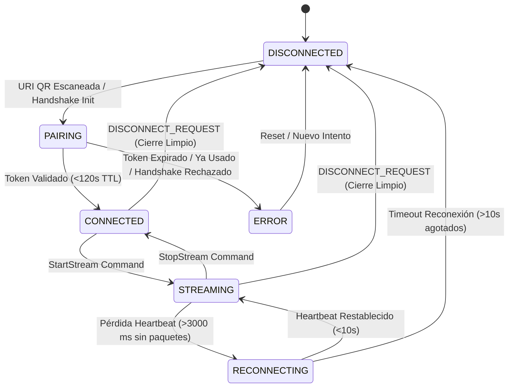

# Plan de Arquitectura: 001-protocol-and-domain-core

## 1. Estructura de Paquetes en `shared/src/commonMain/kotlin`

```
com.vcompanion.shared.core/
├── domain/
│   ├── model/
│   │   ├── ConnectionState.kt         # FSM sellada: DISCONNECTED, PAIRING, CONNECTED, STREAMING, RECONNECTING, ERROR
│   │   ├── ConnectionError.kt         # Error sellado con códigos tipados (TokenExpired, Timeout, etc.)
│   │   ├── PairingConfig.kt           # Host, Port, SessionToken (128-bit), RecommendedFps, RecommendedRes, FallbackHosts
│   │   ├── Telemetry.kt               # FPS, Bitrate, LatencyMs (RTT), Battery, ThermalState
│   │   ├── CameraCommand.kt           # Jerarquía sellada: SetZoom(Float), ToggleTorch, SwitchLens(LensFacing)
│   │   └── ErrorCodes.kt              # Enums inmutables: CommandErrorCode, ConnectionErrorCode
│   └── usecase/
│       ├── GeneratePairingPayloadUseCase.kt
│       ├── ParsePairingPayloadUseCase.kt
│       ├── ValidateSessionTokenUseCase.kt
│       └── ProcessTelemetryUseCase.kt
├── ports/
│   ├── IStreamGateway.kt              # Contrato bidireccional para ProtocolMessage y frames
│   ├── IQrCodec.kt                    # Generador / Validador de URI vcam://pair
│   └── ITelemetryEmitter.kt           # Recolector de métricas de dispositivo
└── protocol/
    ├── ProtocolMessage.kt             # Jerarquía sellada @Serializable con discriminador "type"
    └── SerializationFormat.kt         # Instancia Json compartida { ignoreUnknownKeys = true, encodeDefaults = true }
```

---

## 2. Diagrama de la Máquina de Estados (FSM)



---

## 3. Esquema Polimórfico de Red (`ProtocolMessage`)

```kotlin
@Serializable
sealed class ProtocolMessage {
    @Serializable
    @SerialName("HANDSHAKE_INIT")
    data class HandshakeInit(
        val clientVersion: String,
        val deviceModel: String,
        val sessionToken: String
    ) : ProtocolMessage()

    @Serializable
    @SerialName("HANDSHAKE_ACK")
    data class HandshakeAck(
        val serverVersion: String,
        val approvedFps: Int = 60,
        val approvedResolution: String = "1080p"
    ) : ProtocolMessage()

    @Serializable
    @SerialName("TELEMETRY")
    data class TelemetryPacket(
        val timestamp: Long,
        val metrics: DeviceMetrics
    ) : ProtocolMessage()

    @Serializable
    @SerialName("COMMAND")
    data class CommandPacket(
        val command: CameraCommand
    ) : ProtocolMessage()

    @Serializable
    @SerialName("PING")
    data class Ping(val clientTimestamp: Long) : ProtocolMessage()

    @Serializable
    @SerialName("PONG")
    data class Pong(val clientTimestamp: Long) : ProtocolMessage()

    @Serializable
    @SerialName("DISCONNECT_REQUEST")
    data class DisconnectRequest(val reason: String = "USER_REQUEST") : ProtocolMessage()
}

@Serializable
sealed class CameraCommand {
    @Serializable
    @SerialName("SET_ZOOM")
    data class SetZoom(val zoomRatio: Float) : CameraCommand()

    @Serializable
    @SerialName("TOGGLE_TORCH")
    data object ToggleTorch : CameraCommand()

    @Serializable
    @SerialName("SWITCH_LENS")
    data class SwitchLens(val facing: String) : CameraCommand()
}
```

---

## 4. Estrategia de Pruebas Unitarias (TDD)
- Todas las pruebas residen en `shared/src/commonTest/kotlin/com/vcompanion/shared/core/`.
- Pruebas parametrizadas de parseo y serialización de `vcam://pair?...` con tokens válidos y expirados (TTL 120s).
- Pruebas de transición de la FSM usando `Turbine` sobre el `StateFlow<ConnectionState>`, validando transiciones legales, timeout de 10s en `RECONNECTING` y `DISCONNECT_REQUEST`.
- Pruebas de validación de límites numéricos para `CameraCommand.SetZoom` (1.0 a 5.0) y emisión de códigos de error tipados.
