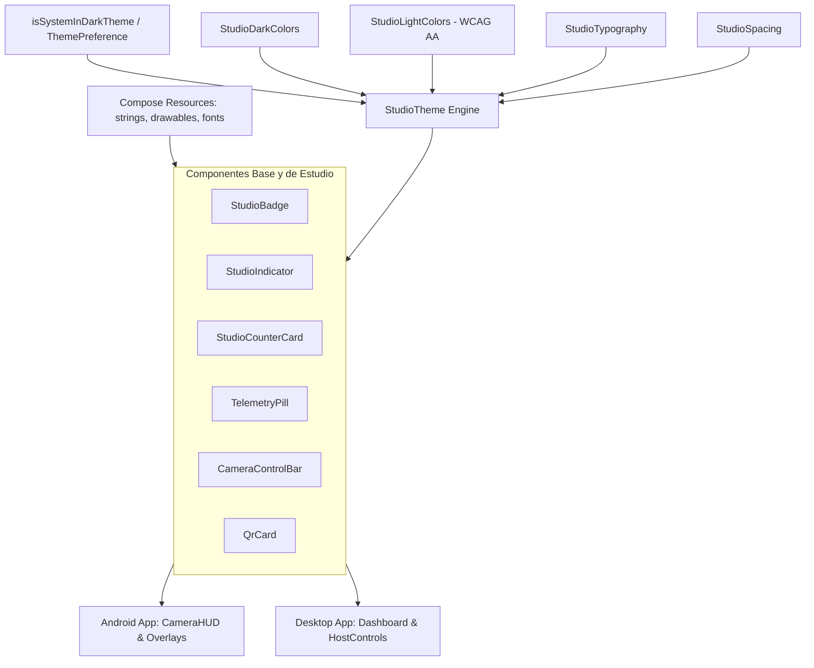

# Plan de Arquitectura: 002-shared-design-system

## 1. Estructura de Paquetes en `shared/src/commonMain/kotlin/.../designsystem`

```
com.vcompanion.shared.designsystem/
├── theme/
│   ├── StudioColors.kt                # Contrato inmutable de colores
│   ├── StudioDarkColors.kt            # Paleta para Modo Oscuro
│   ├── StudioLightColors.kt           # Paleta para Modo Claro (Acentos WCAG AA > 4.5:1)
│   ├── ThemePreference.kt             # Enum: SYSTEM, DARK, LIGHT
│   ├── ThemePreferencesRepository.kt  # Puerto para persistencia reactiva de preferencias
│   ├── StudioTypography.kt            # Familias tipográficas (Inter / JetBrains Mono)
│   ├── StudioSpacing.kt               # Tokens de espaciado: 2dp, 4dp, 8dp, 12dp, 16dp, 24dp, 32dp
│   ├── StudioModifiers.kt             # Modifier.studioGlassmorphic() con fallback elegante
│   └── StudioTheme.kt                 # CompositionLocalProvider con detección reactiva
├── components/
│   ├── StudioBadge.kt                 # Badge LIVE / REC / STANDBY / OFFLINE con pulso y graphicsLayer
│   ├── StudioIndicator.kt             # Indicador circular pulsante de estado
│   ├── StudioCounterCard.kt           # Tarjeta de métricas con valor grande y acento
│   ├── TelemetryPill.kt               # Píldora de FPS y latencia semántica con placeholders
│   ├── CameraControlBar.kt            # Barra flotante glassmorphism de herramientas
│   ├── QrCard.kt                      # Contenedor elegante de presentación de QR
│   └── StudioIconButton.kt            # Botón circular con Touch Target 48dp y estado deshabilitado
└── resources/
    ├── values/
    │   ├── strings.xml                # Textos centralizados accesibles mediante Res.string.*
    │   └── dimens.xml                 # Dimensiones accesibles
    └── drawable/                      # Iconos vectoriales accesibles mediante Res.drawable.*
```

---

## 2. Jerarquía y Flujo de Tokens de Diseño



---

## 3. Especificación de Tokens de Color y Tipografía

```kotlin
@Immutable
data class StudioColors(
    val background: Color,
    val surface: Color,
    val surfaceElevated: Color,
    val textPrimary: Color,
    val textSecondary: Color,
    val liveAccent: Color,
    val standbyAccent: Color,
    val warningAccent: Color,
    val borderSubtle: Color
)

val StudioDarkColors = StudioColors(
    background = Color(0xFF0E1117),
    surface = Color(0xFF161B22),
    surfaceElevated = Color(0xFF21262D),
    textPrimary = Color(0xFFF0F6FC),
    textSecondary = Color(0xFF8B949E),
    liveAccent = Color(0xFFEF4444),
    standbyAccent = Color(0xFF10B981),
    warningAccent = Color(0xFFF59E0B),
    borderSubtle = Color(0xFF30363D)
)

val StudioLightColors = StudioColors(
    background = Color(0xFFF6F8FA),
    surface = Color(0xFFFFFFFF),
    surfaceElevated = Color(0xFFEAEFF5),
    textPrimary = Color(0xFF24292F),
    textSecondary = Color(0xFF57606A),
    liveAccent = Color(0xFFCF222E),       // WCAG AA > 4.5:1 sobre #FFFFFF
    standbyAccent = Color(0xFF1A7F37),    // WCAG AA > 4.5:1 sobre #FFFFFF
    warningAccent = Color(0xFF9A6700),    // WCAG AA > 4.5:1 sobre #FFFFFF
    borderSubtle = Color(0xFFD0D7DE)
)

@Immutable
data class StudioSpacing(
    val extraSmall: Dp = 2.dp,
    val small: Dp = 4.dp,
    val medium: Dp = 8.dp,
    val large: Dp = 12.dp,
    val extraLarge: Dp = 16.dp,
    val section: Dp = 24.dp,
    val screenEdge: Dp = 32.dp
)
```

---

## 4. Degradación Elegante de Glassmorphism

```kotlin
@Composable
fun Modifier.studioGlassmorphic(
    shape: Shape = RoundedCornerShape(16.dp),
    backgroundColor: Color = StudioTheme.colors.surface,
    borderColor: Color = StudioTheme.colors.borderSubtle
): Modifier {
    // En Desktop o Android 12+ (API 31+) se aplica desenfoque en tiempo real
    // En Android 8-11 (API 26-30) se aplica fondo translúcido al 85% sin blur
    return this
        .background(color = backgroundColor.copy(alpha = 0.85f), shape = shape)
        .border(width = 1.dp, color = borderColor, shape = shape)
}
```

---

## 5. Validación Visual y de Tests
- Pruebas unitarias en `shared/src/commonTest` para verificar los contrastes WCAG AA matemáticos en ambas paletas.
- Pruebas sobre la función de mapeo `ConnectionState.toStreamStatus()`.
- Pruebas unitarias de formateo en `TelemetryPill` con umbrales semánticos y placeholders nulos.
