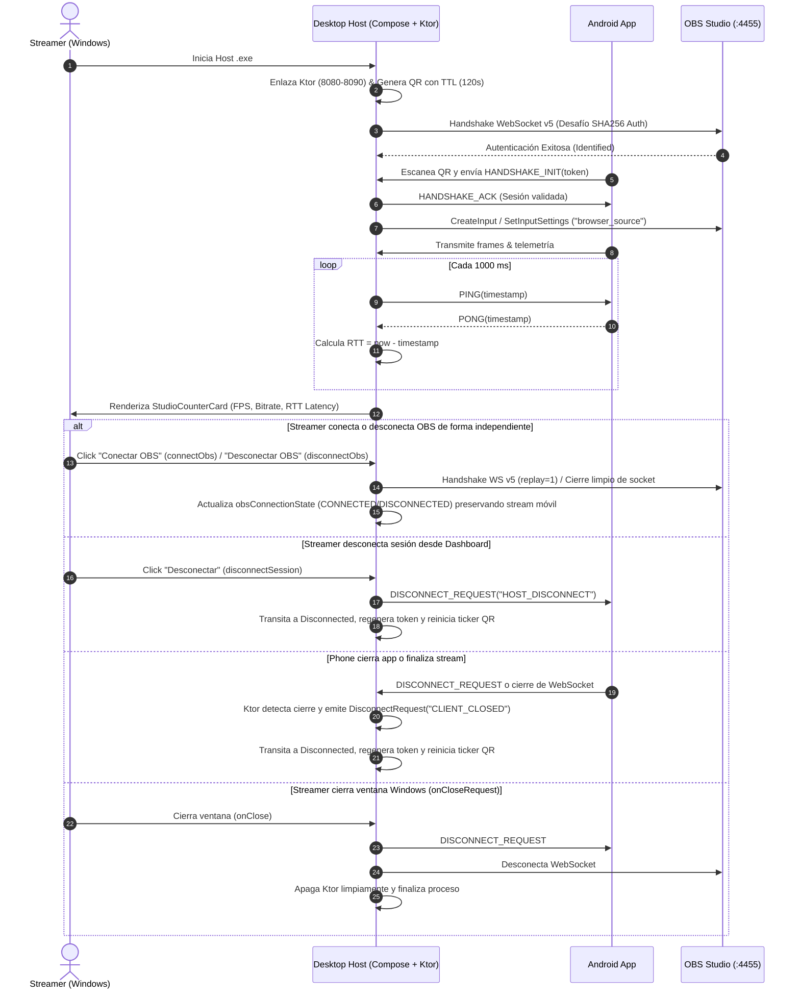

# Plan de Arquitectura: 003-desktop-windows-host

## 1. Arquitectura Hexagonal en `desktopApp`

```
desktopApp/src/desktopMain/kotlin/com/vcompanion/desktop/
├── adapters/
│   ├── inbound/
│   │   └── KtorServerGateway.kt       # Implementa IStreamGateway (Ktor CIO, Ping RTT, fallback 8080-8090)
│   └── outbound/
│       ├── ObsWebSocketAdapter.kt     # Implementa IObsConnector (Ktor WS Client, OBS WS v5, SHA256 auth)
│       └── DesktopNetworkDetector.kt  # Detección de IP en interfaces físicas activas (excluye WSL/VPN)
├── presentation/
│   ├── viewmodel/
│   │   └── DesktopHostViewModel.kt    # MVVM con StateFlow (RTT latency, token TTL, OBS status)
│   └── ui/
│       ├── MainWindow.kt              # Ventana principal Compose Desktop con onCloseRequest
│       ├── QrCanvasRenderer.kt        # Generación de matriz QR vía ZXing Core y renderizado en Compose Canvas
│       ├── QrPairingView.kt           # Vista de espera, QR renderizado, IP:puerto, token legible y cuenta regresiva TTL (120s)
│       └── StreamingDashboardView.kt  # StudioCounterCard (FPS/bitrate/RTT), StudioBadge y StudioIndicator
└── Main.kt                            # Composition Root: inyección e inicio
```

---

## 2. Diagrama de Secuencia: Emparejamiento, OBS v5 y Medición RTT



---

## 3. Configuración de `jpackage` en `desktopApp/build.gradle.kts`

```kotlin
compose.desktop {
    application {
        mainClass = "com.vcompanion.desktop.MainKt"
        nativeDistributions {
            targetFormats(
                org.jetbrains.compose.desktop.application.dsl.TargetFormat.Msi,
                org.jetbrains.compose.desktop.application.dsl.TargetFormat.Exe
            )
            packageName = "VirtualStudioCompanion"
            packageVersion = "1.0.0"
            vendor = "Virtual Studio"
            description = "Virtual Camera and Studio Companion for OBS"
            windows {
                menuGroup = "Virtual Studio"
                upgradeUuid = "6b4d32a0-8f1b-4f40-8b1b-3b7c2598f821"
                iconFile.set(project.file("src/desktopMain/resources/icon.ico"))
            }
        }
    }
}
```

---

## 4. Estrategia de Pruebas Automatizadas
- Pruebas de Ktor Server con `testApplication` verificando enlace dinámico ante puertos ocupados y despacho de `Ping`/`Pong`.
- Mocks para OBS WebSocket v5 verificando el protocolo de autenticación SHA256 y la solicitud `CreateInput` con `browser_source`.
- Pruebas con Turbine sobre `DesktopHostViewModel` validando transiciones de estado, TTL y `onCloseRequest`.
- Pruebas unitarias de codificación y decodificación round-trip de QR en `QrCanvasRendererTest` con ZXing.

---

## 5. Arquitectura de Generación QR (ZXing Core & Compose Canvas)
- **Biblioteca:** `com.google.zxing:core` (Apache 2.0), empaquetada en el micro-runtime por `jpackage`.
- **Generación:** `QRCodeWriter().encode(content, BarcodeFormat.QR_CODE, 0, 0, hints)` genera una `BitMatrix` pura en memoria respetando rigurosamente ISO/IEC 18004.
- **Renderizado:** Composable `@Composable QrCodeCanvas` mapea la `BitMatrix` de dimensiones dinámicas sobre un `Canvas` vectorial de Compose con colores del tema activo (`StudioTheme.colors`).

