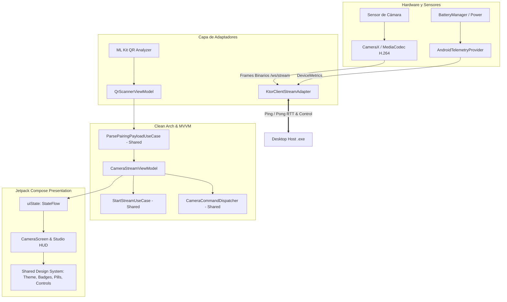

# Plan de Arquitectura: 004-android-mobile-app

## 1. Estructura de Paquetes en `androidApp`

```
androidApp/src/main/java/com/vcompanion/android/
├── adapters/
│   ├── camera/
│   │   ├── CameraXCaptureAdapter.kt   # Implementación del puerto de captura con MediaCodec H.264
│   │   └── QrCodeImageAnalyzer.kt     # Integración con Google ML Kit Barcode Analyzer
│   ├── telemetry/
│   │   └── AndroidTelemetryProvider.kt# Muestreo de batería, estado térmico y mitigación adaptativa
│   └── network/
│       └── KtorClientStreamAdapter.kt # WebSocket binario (/ws/stream), control y responder de Pong RTT
├── presentation/
│   ├── viewmodel/
│   │   ├── CameraStreamViewModel.kt   # MVVM puro con StateFlow y UseCases compartidos
│   │   └── QrScannerViewModel.kt      # Orquestador del escáner óptico
│   └── ui/
│       ├── CameraScreen.kt            # Vista de cámara con FLAG_KEEP_SCREEN_ON y Studio HUD
│       ├── QrScannerScreen.kt         # Visor de escaneo rápido con encuadre guiado
│       ├── PermissionScreen.kt        # Vista de contingencia con Res.string.* y acceso a Ajustes
│       └── components/
│           └── CameraPreviewView.kt   # Envoltorio Compose para PreviewView de CameraX
└── MainActivity.kt                    # Entry point con Compose Navigation y permiso exclusivo CAMERA
```

---

## 2. Diagrama de Flujo de Datos en la Aplicación Móvil



---

## 3. Estrategia de Pruebas Automatizadas
- Pruebas unitarias de `CameraStreamViewModel` con `Turbine` y `MockK` para verificar las transiciones de estado, respuesta a comandos remotos (`SetZoom`, `ToggleTorch`) y despacho de `DISCONNECT_REQUEST`.
- Pruebas unitarias de `KtorClientStreamAdapter` verificando la emisión inmediata de `Pong(clientTimestamp)` ante paquetes `Ping`.
- Pruebas unitarias del analizador óptico `QrCodeImageAnalyzerTest` con URIs simuladas.
