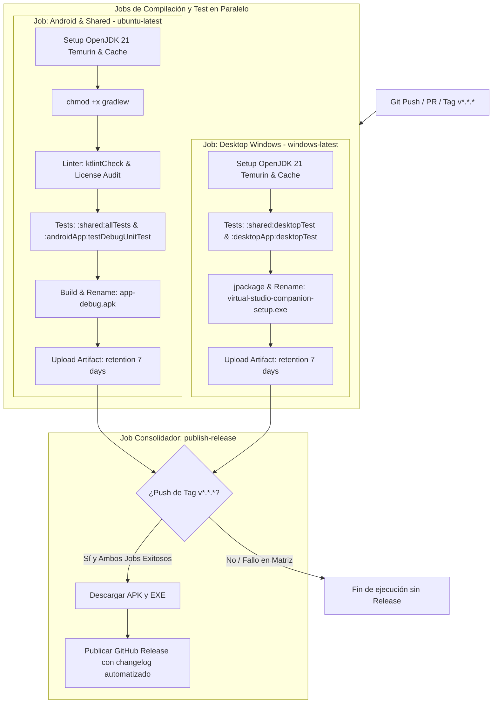

# Plan de Arquitectura: 005-ci-cd-and-distribution

## 1. Topología del Pipeline de GitHub Actions

```
.github/workflows/
└── ci-cd.yml                          # Workflow unificado con matriz de 3 jobs
```

---

## 2. Diagrama de Flujo del Pipeline Multiplataforma



---

## 3. Estructura del Archivo `.github/workflows/ci-cd.yml`

```yaml
name: CI/CD Multiplatform Pipeline

on:
  push:
    branches: [ main, develop ]
    tags: [ 'v*.*.*' ]
  pull_request:
    branches: [ main ]

jobs:
  build-android-and-shared:
    name: Build & Test (Android / Shared)
    runs-on: ubuntu-latest
    steps:
      - uses: actions/checkout@v4

      - name: Set up JDK 21
        uses: actions/setup-java@v4
        with:
          java-version: '21'
          distribution: 'temurin'

      - name: Grant execute permission for gradlew
        run: chmod +x gradlew

      - name: Setup Gradle Cache
        uses: gradle/actions/setup-gradle@v3

      - name: Run Linters & License Audit
        run: ./gradlew ktlintCheck

      - name: Run Unit Tests (Android & Shared)
        run: ./gradlew :shared:allTests :androidApp:testDebugUnitTest

      - name: Build Android Debug APK
        run: ./gradlew :androidApp:assembleDebug

      - name: Stage APK Artifact
        run: |
          mkdir -p staging
          cp androidApp/build/outputs/apk/debug/*.apk staging/app-debug.apk

      - name: Upload APK
        uses: actions/upload-artifact@v4
        with:
          name: android-debug-apk
          path: staging/app-debug.apk
          retention-days: 7

  build-desktop-windows:
    name: Build & Test (Desktop Windows)
    runs-on: windows-latest
    steps:
      - uses: actions/checkout@v4

      - name: Set up JDK 21
        uses: actions/setup-java@v4
        with:
          java-version: '21'
          distribution: 'temurin'

      - name: Setup Gradle Cache
        uses: gradle/actions/setup-gradle@v3

      - name: Run Desktop Tests
        run: ./gradlew :shared:desktopTest :desktopApp:desktopTest

      - name: Package Windows EXE via jpackage
        run: ./gradlew :desktopApp:packageExe

      - name: Stage Windows Artifact
        shell: bash
        run: |
          mkdir -p staging
          cp desktopApp/build/compose/binaries/main/exe/*.exe staging/virtual-studio-companion-setup.exe

      - name: Upload Windows EXE
        uses: actions/upload-artifact@v4
        with:
          name: windows-release-exe
          path: staging/virtual-studio-companion-setup.exe
          retention-days: 7

  publish-release:
    name: Publish GitHub Release
    runs-on: ubuntu-latest
    needs: [build-android-and-shared, build-desktop-windows]
    if: startsWith(github.ref, 'refs/tags/v')
    permissions:
      contents: write
    steps:
      - name: Download Android APK Artifact
        uses: actions/download-artifact@v4
        with:
          name: android-debug-apk

      - name: Download Windows EXE Artifact
        uses: actions/download-artifact@v4
        with:
          name: windows-release-exe

      - name: Create GitHub Release
        uses: softprops/action-gh-release@v2
        with:
          files: |
            app-debug.apk
            virtual-studio-companion-setup.exe
          generate_release_notes: true
        env:
          GITHUB_TOKEN: ${{ secrets.GITHUB_TOKEN }}
```

---

## 4. Estrategia de Verificación
- Verificación sintáctica con validadores oficiales de YAML / GitHub Actions.
- Pruebas en runners simulando ramas principales y eventos de tag.
- Validación de que los nombres de los artefactos coinciden con las especificaciones del proyecto.
